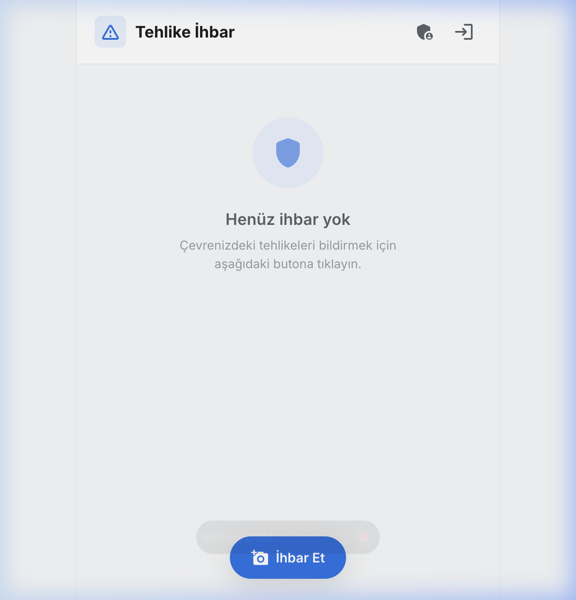
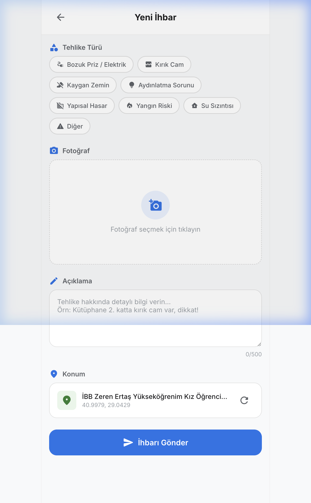

# 🚨 Campus Hazard Reporting System

> **Kampüs Tehlike İhbar Sistemi** — A web application that lets students quickly report hazards they spot on campus (broken outlets, cracked glass, slippery floors, etc.) by snapping a photo and sharing their location.

### 🌐 [Live Demo → app-yga.vercel.app](https://app-yga.vercel.app)

| Home Screen | Report Form |
|:-----------:|:-----------:|
|  |  |

---


## ⚡ Quick Start

```bash
# 1. Clone the repo
git clone https://github.com/berayozder/report-for-campuses.git
cd report-for-campuses

# 2. Install dependencies
npm install

# 3. (Optional) Set up Firebase — copy and fill in your Firebase config
cp .env.example .env
# Edit .env with your Firebase project values

# 4. Start the development server
npm run dev
```

Open **http://localhost:5173/** in your browser. That's it! 🎉

> **Note:** The app works immediately **without** setting up Firebase — it uses localStorage as a fallback. To enable cloud features (real-time sync, Google sign-in, photo storage), set up the `.env` file with your Firebase project config.

---

## 🎯 Features

| Feature | Description |
|---------|-------------|
| 📱 **PWA (Installable)** | Can be installed to home screen with offline fallback support |
| 🌍 **Multilingual (TR/EN)** | Full Turkish and English support with `localStorage` persistence |
| 🔍 **Smart Duplicate Detection** | Finds and shows nearby reports within 500m using Haversine formula |
| ♿ **Accessibility Category** | Dedicated category for accessibility barriers (broken ramps, elevators) |
| 👥 **Role-Based Access** | Admin (manage users), Repairman (my assignments), User (report constraints) |
| 🏆 **Gamification** | Points system, earned badges, and public Leaderboard for top reporters |
| 🏅 **Hall of Fame** | Dedicated view for resolved hazards to build community trust |
| 📈 **Upvoting System** | "Me Too" button to escalate high-priority campus hazards |
| 📸 **Photo Capture** | Take a photo with your camera or pick from gallery |
| 📍 **Auto Location** | GPS detection + reverse geocoding to readable address |
| 🔐 **Google Sign-In** | Firebase Authentication |
| ☁️ **Cloud Storage** | Firestore + Firebase Storage for persistence |
| 👨‍💼 **Admin Panel** | Dashboard with stats, status updates, report assignment, and deletion |

---

## 🏗️ Tech Stack

| Technology | Purpose |
|------------|---------|
| [Vite](https://vitejs.dev/) | Dev server & build tool |
| Vanilla JavaScript | Application logic (no framework) |
| [Firebase Firestore](https://firebase.google.com/docs/firestore) | Database |
| [Firebase Storage](https://firebase.google.com/docs/storage) | Photo storage |
| [Firebase Auth](https://firebase.google.com/docs/auth) | Google sign-in |
| [Nominatim API](https://nominatim.org/) | Reverse geocoding (address from GPS) |

---

## 📁 Project Structure

```
├── index.html           # Entry point with SEO meta tags
├── package.json         # Dependencies & scripts
├── src/
│   ├── main.js          # SPA router — 3 views (Home, Create, Admin)
│   ├── store.js         # Firestore CRUD + localStorage fallback
│   ├── auth.js          # Google sign-in / sign-out
│   ├── firebase.js      # Firebase configuration & initialization
│   ├── location.js      # GPS + Nominatim reverse geocoding
│   ├── utils.js         # Helpers (date formatting, toasts, dialogs)
│   └── styles/
│       └── main.css     # Complete design system (~1000 lines)
└── screenshots/         # App screenshots for documentation
```

---

## 🔥 Firebase Setup (Optional)

> The app works out-of-the-box with localStorage. Follow these steps only if you want cloud persistence.

1. Go to [Firebase Console](https://console.firebase.google.com/) → Create a new project
2. Enable **Firestore Database** (start in test mode)
3. Enable **Storage** (start in test mode)
4. Go to **Authentication** → Enable **Google sign-in** method
5. Add a **Web app** and copy the config values
6. Paste the config into `src/firebase.js`

---

## 📦 Build for Production

```bash
# Build optimized bundle
npm run build

# Preview the production build locally
npm run preview
```

The output is generated in the `dist/` directory.

---

## 🔧 How It Works

The app is a **Single Page Application (SPA)** built with vanilla JavaScript and Vite:

- **3 Views**: Home (report list), Create Report (form with camera/GPS), Admin Panel (stats + management)
- **Dual Storage**: Detects if Firebase is configured — if yes, uses Firestore with real-time listeners; if not, falls back to `localStorage`
- **Location**: Uses the browser's Geolocation API for GPS coordinates, then calls Nominatim for a human-readable address
- **Auth**: Optional Google sign-in via Firebase Auth — reports can be submitted without login

---

## 📄 License

Built for **YGA** — Young Guru Academy
